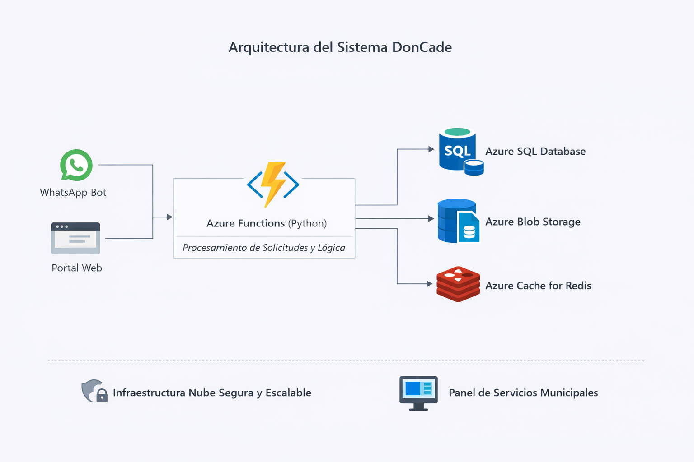
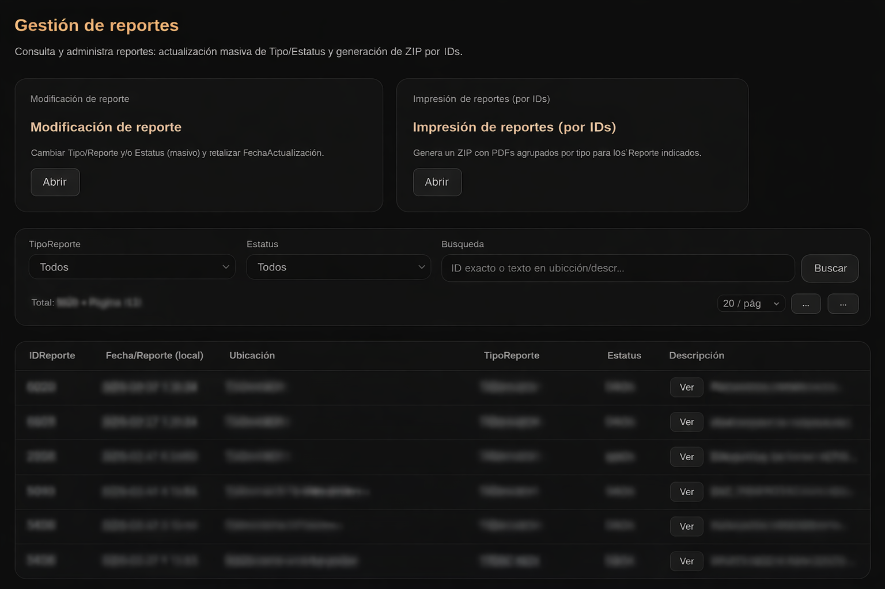

# DonCade

> El código fuente de este proyecto es privado debido a confidencialidad institucional.  
> Este documento describe la arquitectura, decisiones técnicas y resultados del sistema.

---

## Descripción General
DonCade es una plataforma digital orientada a la **gestión de reportes ciudadanos y servicios municipales**, diseñada para centralizar solicitudes, automatizar procesos y mejorar la atención a la ciudadanía mediante canales digitales.

El sistema integra mensajería, formularios web, almacenamiento de documentos y generación automatizada de reportes.

---

## Objetivo del Proyecto
- Centralizar reportes ciudadanos en un solo sistema
- Automatizar la recepción, clasificación y seguimiento de solicitudes
- Reducir tiempos de atención y errores manuales
- Facilitar la generación de reportes y documentos oficiales

---

## Arquitectura

**Stack tecnológico:**

- **Backend:** Azure Functions (Python)
- **Base de datos:** Azure SQL Database
- **Almacenamiento:** Azure Blob Storage
- **Frontend:** Next.js
- **Mensajería:** WhatsApp (Twilio)
- **Cache / Estado:** Redis (Azure Cache for Redis)
- **Infraestructura:** Microsoft Azure

Arquitectura orientada a servicios, con funciones desacopladas y manejo de estado conversacional.

---

## Seguridad
- Separación de responsabilidades por servicio
- Manejo seguro de credenciales mediante variables de entorno
- Control de acceso por rol en módulos administrativos
- Uso de almacenamiento seguro para archivos y documentos
- Diseño enfocado en minimizar exposición de datos sensibles

---

## Funcionalidades Clave
- Recepción de reportes ciudadanos vía WhatsApp
- Formularios web para captura estructurada de información
- Manejo de estado conversacional por usuario
- Almacenamiento y gestión de archivos (PDF, imágenes)
- Generación automática de documentos y reportes
- Panel administrativo para revisión y seguimiento
- Exportación de información para análisis y control

---

##  Retos Técnicos
- Manejo de múltiples usuarios concurrentes en mensajería
- Persistencia y recuperación de estados conversacionales
- Optimización de consultas en Azure SQL
- Gestión eficiente de archivos en Blob Storage
- Balance entre automatización y control administrativo
- Seguridad y privacidad de la información ciudadana

---

## Mi Rol en el Proyecto
- Diseño de la arquitectura general del sistema
- Desarrollo completo del backend en Azure Functions
- Modelado y administración de base de datos en Azure SQL
- Integración con WhatsApp mediante Twilio
- Implementación de almacenamiento en Azure Blob Storage
- Automatización de flujos y generación de documentos
- Soporte técnico y evolución del sistema
- Capacitacion de personal

---

## Decisiones Técnicas Clave

- **Arquitectura Serverless (Azure Functions):** se eligió para escalar bajo demanda, reducir operación de servidores y facilitar despliegues incrementales por módulo.
- **Azure SQL como fuente de verdad:** se mantuvo un modelo relacional para consistencia, trazabilidad y reporting (panel administrativo y analítica).
- **Redis para estado conversacional y performance:** se utilizó para mantener estados por usuario y reducir lecturas repetitivas a SQL en flujos conversacionales, mejorando latencia y concurrencia.
- **Blob Storage para documentos:** se desacopló la gestión de archivos del modelo relacional, permitiendo almacenamiento escalable de PDFs e imágenes sin degradar el performance de la base de datos.
- **Separación de canales (WhatsApp / Web):** ambos consumen el mismo backend, evitando duplicidad de lógica y manteniendo una única capa de reglas de negocio.
- **Diseño orientado a privacidad:** se limita la exposición de datos sensibles en mensajes/respuestas, y se prioriza el almacenamiento seguro y trazable.

---

## Resultados
- Más de **10,000 reportes ciudadanos** procesados
- Atención a **8,000+ usuarios** (vía WhatsApp y Web)
- Centralización de reportes ciudadanos
- **Reducción del tiempo de respuesta ~80%** mediante automatización y centralización del flujo
- Mejora en tiempos de respuesta
- Sistema escalable y mantenible
- Base sólida para ampliación de servicios municipales
- Plataforma en operación real y en mejora continua

---

## Evidencia Visual

### Panel de Administración (anonimizado)

---

## Estado
En operación / Evolución continua
